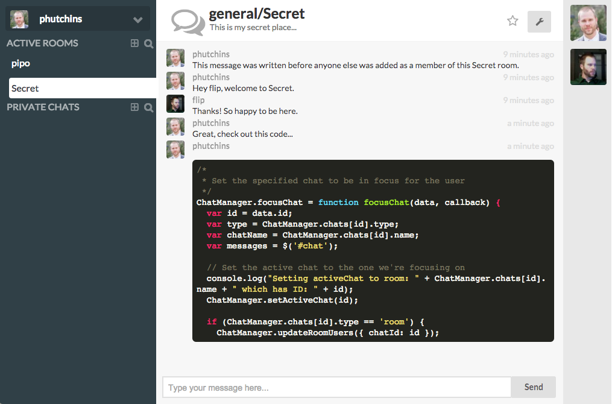
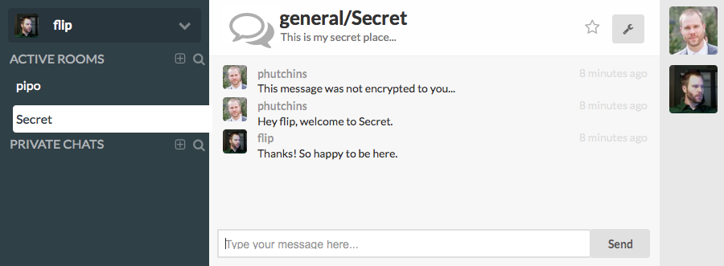

# PiPo - A secure chat client with client side encryption written in NodeJS

## Goal
PiPo's goal is to make secure communication easy to use and open source. It is a client server appilcation that aims to remove the server from being a vulnerable point in the communication chain.

## Features

+ Client side encryption using AES-256 keys
+ Your private key never leaves your device
+ Key backup and restore
+ Markdown using the Marked Library and React (https://github.com/chjj/marked, https://facebook.github.io/react/)
+ Avatars from Gravatar

## Encryption

Currently PiPo uses the KbPGP library to do PGP encryption. Behind this is AES-256 with 4096 bit keys.

## Screenshots

## How it works...
When a user signs up with their username, email address and password, an AES-256 keypair is generated within their browser. The public part of that keypair is then uploaded to the server and associated with that username. From here, access is granted to private rooms by an admin. The addition of this user is signed in a transaction that can then be verified by all clients back to one of the original two administrators. This removes the possibliity of a malitious attacker injecting their public key onto a compromised server and tricking users into sending them messages thinking they are someone else.

## Dev/Test Setup
To test out PiPo, I've included a sample adminCertificate. You should not use these for production as you do not have the private keys associated with these admin certificates.

+ Copy adminData.sample to adminData
+ The app will now start up in Client Key mode
+ Start the app
    node server.js

## Setup
+ Place two admins public keys in adminData in the format username.pub
  + Generate Two Keys (repeat this process for the second key)
    + gpg --gen-key
    + Choose RSA and RSA
    + keysize should be at least 2048
    + Choose an amount of time for the key to expire
    + Your real name should be your username for pipo
    + Enter your email address
    + Comment can be blank if you like
    + Use a secure passphrase to protect your key
  + Export your public and private key to a file
    + List your secret keys to find the userID of your key which is a combination of full name (your username that you entered) along with email and comment
      + gpg --list-secret-keys
    + gpg --export -a "username <username@mydomain.com>" --output adminData/username.pub
    + gpg --export-secret-key -a "username <username@mydomain.com>" --output adminData/username.key
    + Place the two username.pub files in the adminData directory
  + Run node setup again
  + Generate a clearsign signature from each secret key for the generated adminPayload
    + gpg --clearsign -u "username <username@mydomain.com>" adminData/adminPayload --output adminData/username.sig
  + Run node seutp again
    + You should see the server start and tell you that out found the signatures
    + This will generate the adminCertificate
  + Run npm start to start the server (make usre Mongo is running)

## Protocol Outline & Planning Considerations

### Authentication
+ Initial Signup
  + signature verification, user creates invite object with a random token created by the client
  + this token is sha256 hashed and sent to the server,
  + the client pgp encrpts the non-hashed token and sends it to the invitee
  + then only the invitee can decrypt the token and then can send it to the server,
  + which can do a sha256 and say oh yeah thats right
+ authenticate and sign of request using pgp keys?
+ node_http_signature
  + Positives
  + Negatives
    + Whitepaper not quite complete yet
    + Have not addressed two factor
    + Does not include eliptical curve in their docs
    + * Does not have revocation for identity in case of compromise *
+ sqrl
  + Positives
    + Creates QR codes to scan with phnoe for authentication with sessions which is easy
    + Creates revocation
    + Allows you to print QR code for private key so it does not exist elictroncially
  + Negatives
    + Seems over engineered
    + Uniqe terms for all types of keys so it is cryptic cryptography

### Sessions
+ Use keyid to verify user and do not use sessions?
+ How do we indicate that the data is encrypted?

### Server Management of Keys
+ Server generates a shared private key
+ Server encrypts private key to all users that are granted access using their personal public key
+ Server destroys unencrypted shared private key
+ Server sends new encrypted private key to users as they sign on
  + Possible to have client with rights to add user create the private key and encrypt to all users then upload to server

## Mobile
+ Ionic or Famous & Socket.io
  + Famous - Is very new but quite powerful and fast
  + Ionic - Been around for a while

## Desktop & Browser
+ NodeJS & Node WebKit

### Problem & Solution Walkthrough
+ Problem
  + Easy passwords are easy to hack, more secure passwords are hard to remember and use
+ Solution
  + Use key pairs or something similar (Something like PGP)
+ Problem
  + Want to proove identification and communicate securely
+ Solution
  + Encryption should be done client side
  +
+ Problem
  + PGP is hard for the normal user
+ Solution

+ Problem
  + Managing Keys is tricky
+ Solution

+ Problem
  + Communication in this way is hard with multiple people

# UX Flow
+ User Signup / Login
  + User visits the PiPo URL
  + If the user has cached login info in their browser, go to Path B
  + If the user does not have cached login data, prompt to Register (Path A) or Authenticate (Path B)
  + Path A - Register ( never registered )
    + Path 1 - Open registration
      + User asked to Generate new Key Pair or Upload Existing Key Pair
        + Genreate
          + User prompted for userName, fullName, email, password (for their private key)
          + Keypair is generated showing a prompt while the user waits
          + User is dropped into the default chat room
          + User gets NEW USER path or Straight to chat
        + Upload
          + User prompted for public & private keys
          + User prompted for userName, fullName, email, password (for their private key)
            + decrypt private key locally with password success or failure
            + re-prompt for password if failure (give the option to upload a different keypair)
          + User is dropped into default chat room
          + User gets NEW USER path or Straight to chat
    + Path 2 - Signup request
      + User is notified that registration is on approval only basis and given the option to request approval
      + User is prompted to upload public & private keys
      + User is prompted for userName, fullName, email, password (for their private key)
      + User is notified that their application has been submitted and will be reviewed
      + Upon approval user is sent an email stating that it has been approved and the user would proceed down Path B
    + Path 3 - Email domain confirmation
      + User is notified that registration is available to a restricted user set only and given the option to continue registration
      + User is prompted to upload public & private key
      + User is prompted for userName, fullName, email, password (for their private key)
      + If the email matches the approved domain list
       + User is notified that they will receive an email with a link to active their account
       + Upon activation link
         + User is prompted to decrypt their private key
         + User is notified that their account is being activated
         + If activation link is valid
           + User is dropped into default chat room
           + User gets NEW USER path or Straight to chat
         + If activation link is not valid, sorry, resend activation email or contact an admin
      + If the email does not match the approved domain list
       + User is notified that they are not approved to register and to contact the admin if they think this is an error
    + Path 4 - Signup by invite URL
      + User receives invite URL and visits
      + User follows Path 1 from here
  + Path B - Already Registered ( load credentials and authenticate )
    + User follows Path 1 > Upload
    + User does not get prompted for NEW USER path

+ NEW USER path
  + User has the option to be guided through uploading avatar and how to use pipo

# MVP Feature List
+ Ability to generate revocation key
+ Use revocation key to change current key
+ Emoticons
+ Finish notifications
  + Highlight Room or Chat until clicked
  + Title bar should flash until selected
  + Email notification
    + Email for messages when offline
    + Email after certain time of message not being viewed when online
+ File transfer (peer to peer)

